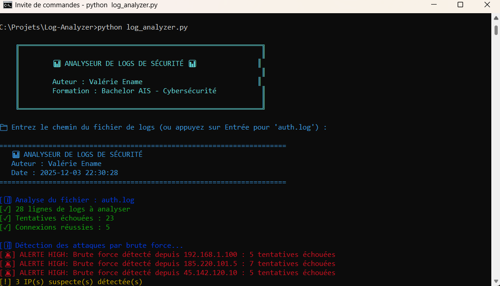

# 📊 Security Log Analyzer

Analyseur de logs de sécurité développé en Python pour détecter les tentatives de brute force, identifier les IPs suspectes et analyser les patterns d'attaque.

## 🎯 Fonctionnalités

### Détection de Menaces

✅ **Brute Force Detection**
- Détection automatique des tentatives répétées
- Seuil configurable de détection
- Alertes par niveau de sévérité (HIGH, MEDIUM, LOW)

✅ **Analyse d'IPs**
- Identification des IPs les plus actives
- Top 10 des IPs suspectes
- Comptage des tentatives par IP

✅ **Analyse de Comptes**
- Comptes utilisateurs les plus ciblés
- Détection des attaques sur comptes sensibles (root, admin)
- Statistiques par utilisateur

✅ **Connexions Suspectes**
- Détection de connexions réussies après échecs multiples
- Corrélation IP/utilisateur

### Visualisation

✅ **Graphiques automatiques**
- Top IPs suspectes (graphique horizontal)
- Top comptes ciblés (graphique vertical)
- Export PNG haute résolution

✅ **Rapport HTML professionnel**
- Design moderne et responsive
- Statistiques globales
- Liste des alertes
- Tableaux détaillés
- Ouverture automatique dans le navigateur

## 📸 Captures d'écran




## 🛠️ Technologies

- **Python 3.x**
- **matplotlib** : Génération de graphiques
- **pandas** : Manipulation de données (optionnel)
- **colorama** : Messages colorés

## 📦 Installation
```bash
# Cloner le repository
git clone https://github.com/VAL-cyber-pentester/Security-Log-Analyzer.git
cd Security-Log-Analyzer

# Installer les dépendances
pip install matplotlib pandas colorama
```

## 🚀 Utilisation

### Analyse avec fichier par défaut
```bash
python log_analyzer.py
```

### Analyse avec fichier spécifique
```bash
python log_analyzer.py /path/to/your/auth.log
```

### Formats de logs supportés

Le script analyse les logs SSH au format standard :
```
Dec  1 10:23:45 server sshd[1234]: Failed password for root from 192.168.1.100 port 22 ssh2
Dec  1 10:24:01 server sshd[1239]: Accepted password for user1 from 192.168.1.50 port 22 ssh2
```

## 📊 Exemple de Sortie

### Terminal
```
📊 ANALYSEUR DE LOGS DE SÉCURITÉ
[✓] 28 lignes de logs à analyser
[✓] Tentatives échouées : 23
[✓] Connexions réussies : 5

[🚨] ALERTE HIGH: Brute force détecté depuis 185.220.101.5 : 7 tentatives échouées
[🚨] ALERTE HIGH: Compte sensible ciblé : root (12 tentatives)
```

### Rapport HTML
- Résumé avec statistiques visuelles
- Alertes de sécurité détaillées
- Top 10 IPs suspectes
- Top 10 comptes ciblés

### Graphiques
- Diagramme en barres horizontales (IPs)
- Diagramme en barres verticales (Comptes)
- Export PNG haute qualité

## ⚙️ Configuration

Vous pouvez modifier les seuils de détection dans le code :
```python
self.BRUTE_FORCE_THRESHOLD = 5  # Nombre de tentatives pour brute force
self.TIME_WINDOW = 300  # Fenêtre temporelle en secondes
```

## 🎓 Compétences Développées

- **Analyse de logs** : Parsing et extraction d'informations
- **Détection de menaces** : Identification de patterns d'attaque
- **Python** : Regex, collections, visualisation de données
- **SOC** : Méthodologie d'analyse de sécurité
- **Reporting** : Génération de rapports professionnels

## 📈 Améliorations Futures

- [ ] Support de multiples formats de logs (Apache, Nginx, etc.)
- [ ] Géolocalisation des IPs attaquantes
- [ ] Intégration avec des bases de threat intelligence
- [ ] Export JSON/CSV des résultats
- [ ] Analyse en temps réel (monitoring continu)
- [ ] Dashboard web interactif
- [ ] Corrélation d'événements multi-sources
- [ ] Alertes par email/SMS

## 🔍 Cas d'Usage

- **SOC** : Analyse quotidienne des logs de sécurité
- **Audit** : Évaluation de l'exposition aux attaques
- **Forensic** : Investigation post-incident
- **Formation** : Apprentissage de l'analyse de logs

## 📚 Ressources

- [NIST Log Management Guide](https://csrc.nist.gov/publications/detail/sp/800-92/final)
- [SANS Log Analysis](https://www.sans.org/reading-room/whitepapers/logging/)

---

**Projet réalisé dans le cadre du Bachelor AIS - Cybersécurité**

**Auteur :** Valérie Ename  
**Formation :** Administrateur d'Infrastructures Sécurisées  
**Portfolio :** [val-cyber-pentester.github.io](https://val-cyber-pentester.github.io)  
**GitHub :** [VAL-cyber-pentester](https://github.com/VAL-cyber-pentester)
```


